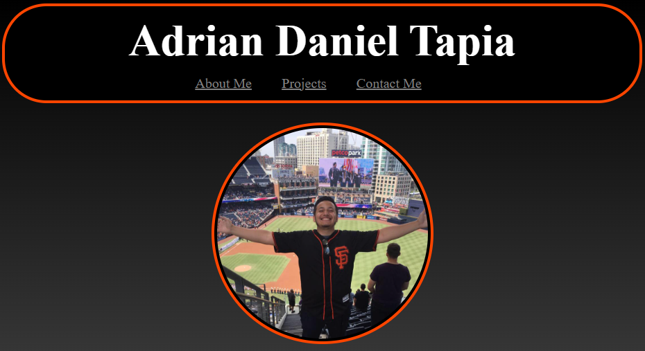
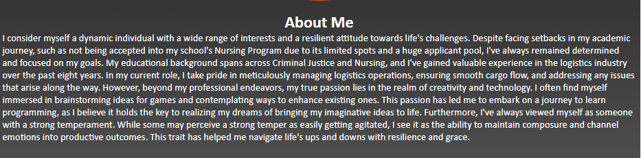
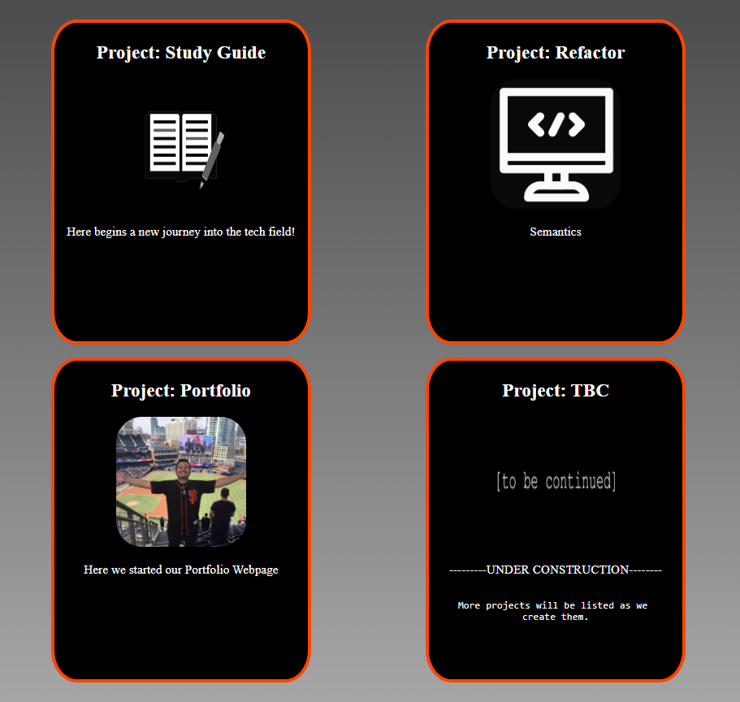

# Professional Portfolio Website

## Description

I am Adrian Daniel Tapia and this is my portfolio website. You can use it to look into my skills, projects, the start of my career in programming.

## Features

- About Me

- Projects

- Contact Me

## Technologies Used

- We are currently using html and css.

## Installation

- Clone repository to your local machine.
- Open the index.html file with your web browser.

## Usage

- Serves to demonstrate my knowledge and skills in programming

## License

MIT License LICENSE
